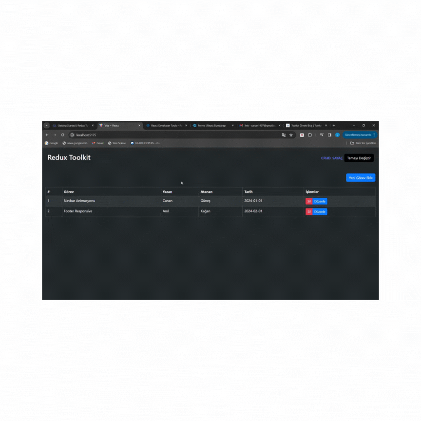

# Redux Toolkit

# Redux Toolkit

- Klasik Redux'a göre daha az kod içerir.

- Dahili olarak thunk içerisinde gelir.

- Devtoolks eklentisi sayesinde proje geliştirirken store'u, reducer'ları, action'ları izleyebiliyoruz.

-Veri yönetimi daha kolay olacak

# Kurulum 
- Kütüphaneler kurulmalı
- npm install @reduxjs/toolkit
- npm install react-redux

# Slice

- Redux Toolkit'in içinde yer alan ve reducer'ı ve aksiyonları bir araya getiren yapıdır.

- Klasik redux'ta aksiyonları ayrı reducer'ları ayrı dosyalarda tanımlıyorduk. 

- Toolkit ile birlikte slice yapılarında sadece aksiyonların görevini yazıyoruz. 

- Slice yapısı bizim için hem aksiyon objelerini hemde reducer'ları kendisi oluşturuyor.

- 
